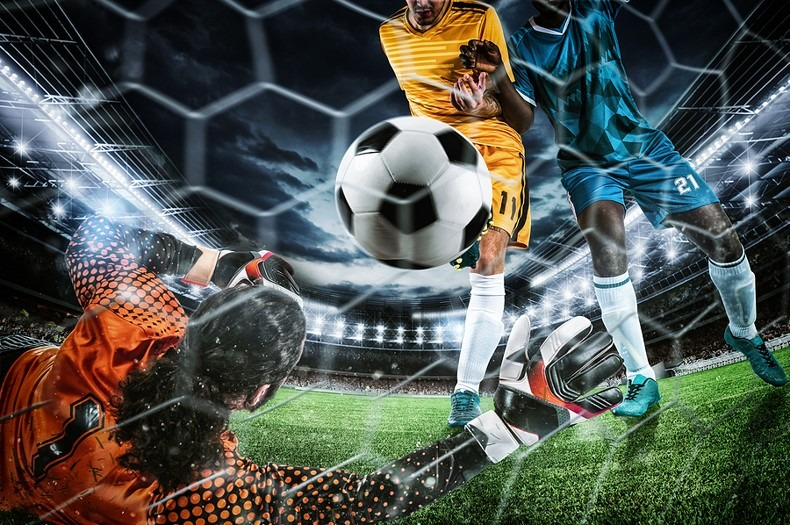

<!DOCTYPE html>
<html>
<head>
<title>SISM-Extra-curriculum</title>
<meta charset="UTF-8">
<meta name="viewport" content="width=device-width, initial-scale=1">

</head>
<body>

<!-- Note -->

<!-- Header -->
<header>
  <h1>Soka International School Malaysia</h1>
  
ECA  <b>at</b> SISM

</header>

<!-- Navigation Bar -->

  <a href="index.html">About ECA</a>
  <a href="football.html">Football ECA</a>
  <a href="archery.html">Archery ECA</a>

<!-- Content Container -->

  

   
  

    <h2>Extra-Curriculum At SISM</h2>
    <h5>FOOTBALL!!!!!</h5>
 
  
    <h2>Football</h2>
    <h5>mar 3, 2026</h5>
    
Football ECA is a extra curricular activity that involves 2 teams of 11 players on a field. There are 2 goals, one for each team, and the goal is to score the ball into the opponents goal while protecting your own goal. The winner is decided by who has the most points after a 90 minute match. Football ECA is a great way to have fun and exercise at the same time, and dont worry about the heat as it is played at night!

<video width="350" controls>
<source src="ICT.mp4" type="video/mp4">
</video>
    

</body>
</html>
